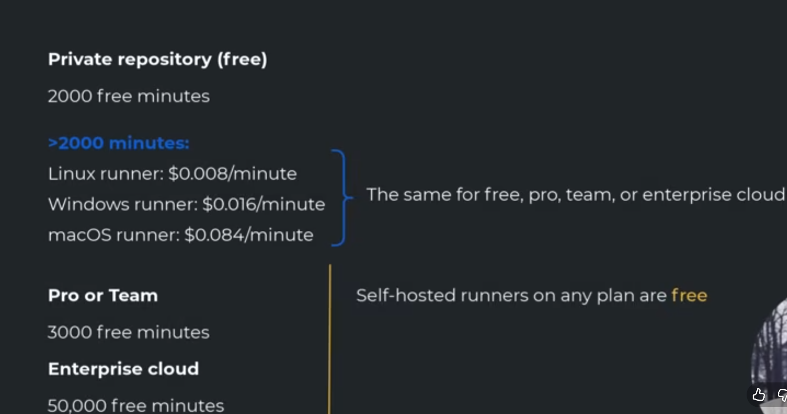

## GitHub Actions >> means Workflow
- ### it allows you do many things included CI/CD 
- ### The problem????
- Each pull request we need to apply some tests before merging to the dev branch ( CI )
- Releasing a new version, which is preferably deployed manually. ( CD )
<details><summary>WHERE IS THE DEFAULT PATH</summary><p>
  
```
  RepoName/.github/workflows/yaml_name.yml
```
  
OR click on 
  
```
  Actions>> setup your workflow as you need, which create it inside `RepoName/.github/workflows/yaml_name.yml`
```

</p>
</details>

<details><summary>THE ARCHITECHTURE</summary><p>

  

```
Trigger ( the same concept of airflow )
1- based on events >> pull request, push, or something like that
2- scheduled time using cron job>> * * * * *
3- manually
```
------------------------------------------------

```
Jobs ( is like task that contains steps to execute)
# make the steps with the relevant job
# all jobs run in parallel until you specify " needs word " to make dependency jobs 
job1
  step1
    - name : Checkout code  # any -name is printed on the console for troubleshooting 
     uses  : actions/checkout@v4   # search about checkout to the get last version
                                   # we must use to get the code because the GitHub doesn't automatically get the code on the repo
  step2
    - name:
    run : command 
  step3

job2
  step1     
  step2      
  step3

job3
  needs: job2
  step1     
  step2      
  step3

job4
  needs: job2 && job 1
  step1     
  step2      
  step3

job 1 |>>>>>|
      |     | >> job4
job 2 |>job2|
```

------------------------------------------------

```
where do the jobs run on???
1- GitHub-hosted runner using Operating Systems
 1.1 Linux
 1.2 Windows
 1.3 MacOs

2- Self-hosted runner ( GitHub communicates with it ) 
 2.1 Docker containers
 2.2 K8s

for example
runs_on:
  ubuntu_latest

```
------------------------------------------------


#### Pricing

```
private
1- we have price if we use GitHub-hosted runner like Linux, Windows, Or MacOs
2- if we use self-hosted ( on the cloud like AWS, Azure, GCP, or local-host ), there is no cost
```



--------------------------------------------------
```
public is free
```

 

--------------------------------------------------

```
CI workflow 
event:
  pull_request

runs_on:
  ubuntu_latest
Jobs

job1
  - step one
  - step two

job2
  - step one
  - step two

```


--------------------------------------------------

</p>
</details>


<details><summary>Examples of WorkFlows</summary><p>

- imagine GitHub make virtual merge, which is not real merge, to test the code as whole ( old code + new features ) 

```
Workflow
│
├── name
├── on
│
└── jobs
    │
    ├── runs-on
    └── steps
        ├── uses
        ├── run
        ├── with
        ├── env
        └── if
```

--------------------------------------------------

### Based on push or pull request event
```
name: CI                                # The name of The workflow 

on:                                     # The event based on push or Pull request
  push:                                 # whenever there is a push on main branch, run that workflow
    branches:
      - main
    paths:                             # when there is any modified file in these paths because the modification maybe in readme or useless file that is the main code to check
      - 'jobs/**'                      # and the code takes minutes to run, so we need to run the pipeline when the readme file updated.
      - 'config/**'
      - 'tests/**'


  pull_request:                        # whenever there is a Pull Request on main branch, run that workflow
    branches:
      - main
    paths:                            # specified the paths you want to track if there is a modified file 
      - 'jobs/**'
      - 'config/**'
      - 'tests/**'

jobs:
  build:                              # first job name
    runs-on: ubuntu-latest            # runs on ubuntu

    steps:                           # All its own steps
      - name: Checkout code          # print that on the console
        uses: actions/checkout@v4    # we must to make checkout the code in the repo

      - name: Install dependencies   # print that on the console
        run: pip install -r requirements.txt   # run this command 

      - name: Run tests              # print that on the console
        run: pytest                  # run the tests

      ### there are many ways to run
        run: pytest
        run: python app.py

        run: |                        # using pipe
          pip install -r requirements.txt   # contains all req or lib
          pytest
          python main.py
```
 
--------------------------------------------------

## Manual Deployment

```
name: Manual Deployment

on:
  workflow_dispatch:   # manual deployment
    inputs:            # takes input
      environment:     # named enviornment
        description: "Choose the deployment environment"
        required: true
        default: staging   # the default value
        type: choice
        options:
          - staging
          - production

jobs:
  deploy:
    runs-on: ubuntu-latest

    steps:
      - name: Checkout code
        uses: actions/checkout@v4

      - name: Deploy to Staging
        if: ${{ inputs.environment == 'staging' }}
        run: |
          echo "Deploying to STAGING"
          # staging deployment commands here

      - name: Deploy to Production
        if: ${{ inputs.environment == 'production' }}
        run: |
          echo "Deploying to PRODUCTION"
          # production deployment commands here
```

--------------------------------------------------

</p>
</details>
