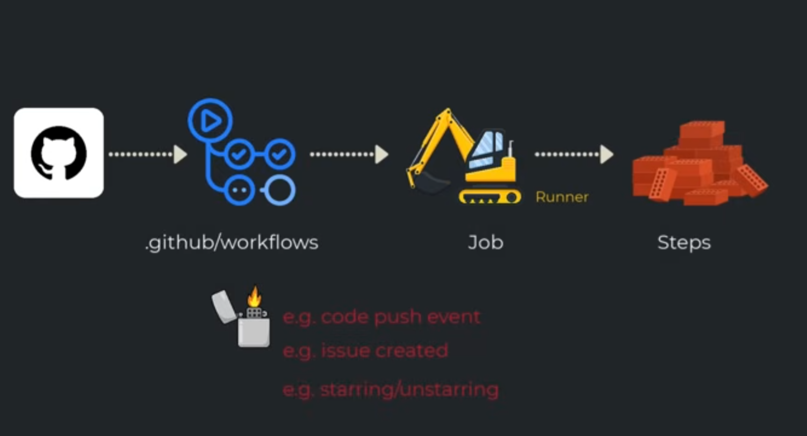

## GitHub Actions >> means Workflow
- ### it allows you do many things included CI/CD 

<details><summary>WHERE IS THE DEFAULT PATH</summary><p>
  
```
  RepoName/.github/workflows/yaml_name.yml
```
  
OR click on 
  
```
  Actions>> setup your workflow as you need, which create it inside `RepoName/.github/workflows/yaml_name.yml`
```

</p>
</details>

<details><summary>THE ARCHITECHTURE</summary><p>

  

  
</p>
</details>
